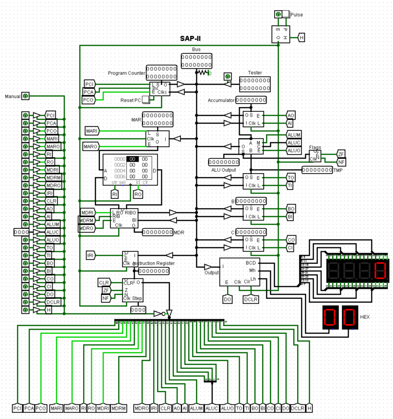
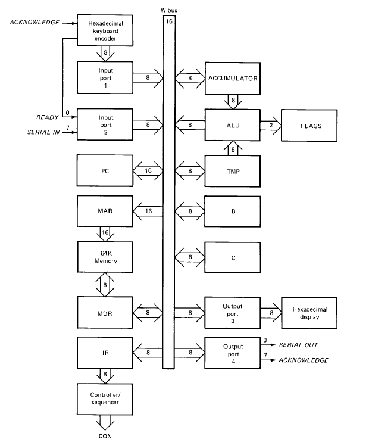
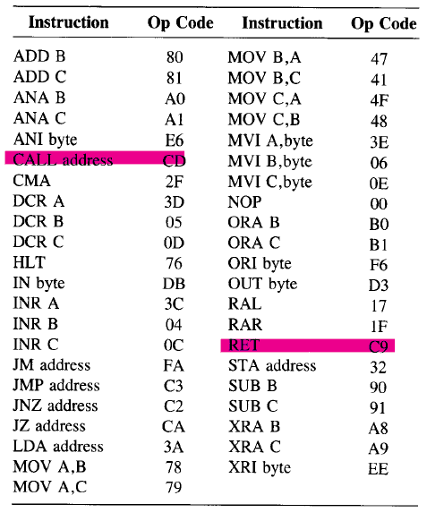

# SAP-II
A Logism Implementation of SAP-II With 41/43 OP Code Instructions

## SAP Overview
  
The deisgn is based on the SAPII concept found at: [Digital Computer Electronics by Malvino](https://www.amazon.com/Digital-computer-electronics-Albert-Malvino/dp/0070398615)
## The Book's Concept

## The Included Instruction Sets
Their operation may be found on this listed [spreadsheet](https://docs.google.com/spreadsheets/d/1cdu6gaBE6KouO7dhLjl7q_ZU_eX6BQgEp3AK9j4j_8M/edit?usp=sharing)  

